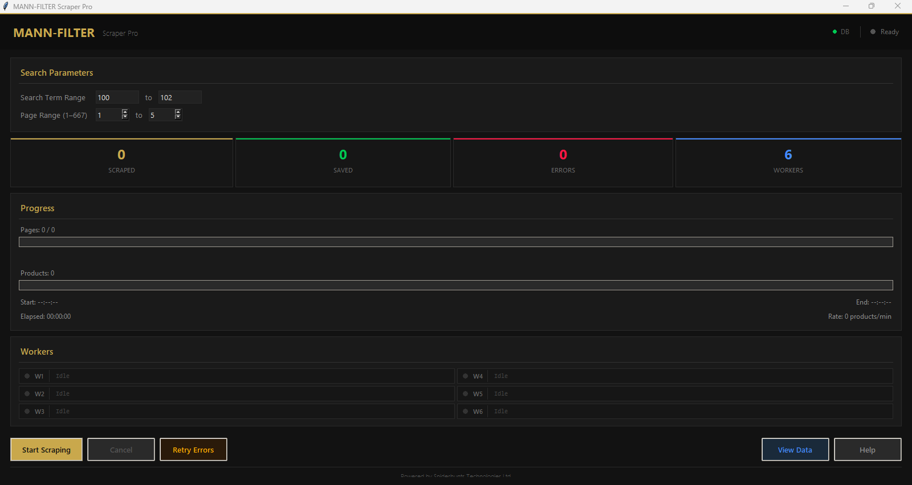
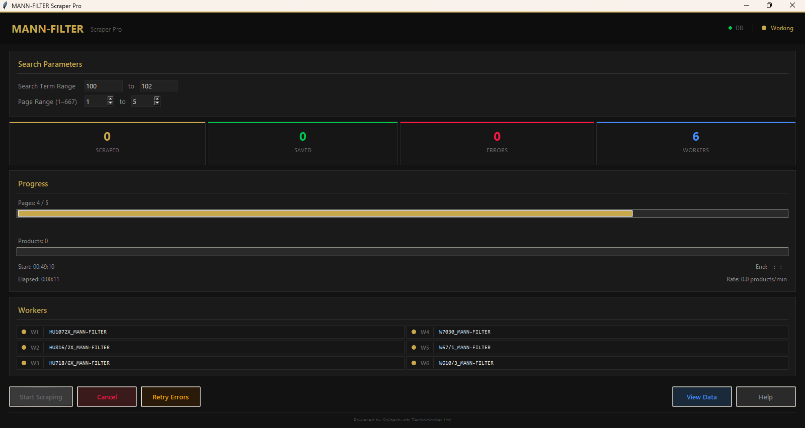
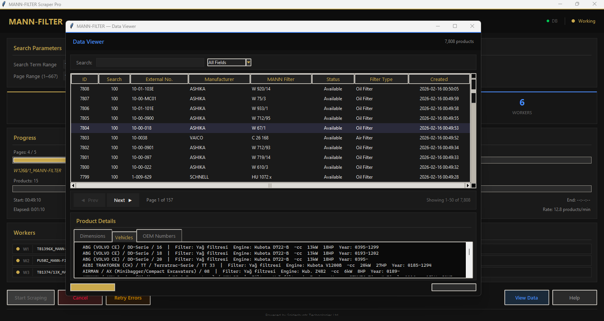

# MANN-FILTER Scraper

A desktop application that scrapes product data from the MANN-FILTER catalog and stores it in a MySQL database.

## Screenshots

### Main Dashboard


### Scraping in Progress


### Worker Status Panel


### Data Viewer


## Features

- **GraphQL API scraping** — fetches product listings from the MANN-FILTER catalog API
- **Selenium page scraping** — extracts detailed product data (dimensions, vehicles, OEM numbers) from individual product pages
- **Multi-threaded** — 6 parallel Chrome workers for product scraping, 4 concurrent API page fetchers
- **MySQL storage** — saves all scraped data into a structured relational database
- **Dark-themed GUI** — professional tkinter interface with real-time progress tracking
- **Worker status panel** — live view of what each worker thread is processing
- **Error tracking & retry** — failed products are logged and can be retried from the error window
- **Data viewer** — browse all scraped data with server-side pagination and search
- **Splash preloader** — animated loading screen on startup
- **Loading overlays** — background operations show loaders instead of freezing the UI

## Prerequisites

- **Python 3.10+**
- **MySQL Server** running locally
- **Google Chrome** installed (Selenium uses Chrome in headless mode)

## Setup

1. **Clone the repository**

   ```bash
   git clone <repo-url>
   cd man-filters
   ```

2. **Create a virtual environment and install dependencies**

   ```bash
   python -m venv venv
   venv\Scripts\activate        # Windows
   # source venv/bin/activate   # macOS/Linux
   pip install -r requirements.txt
   ```

3. **Configure the database**

   Edit the `DB_CONFIG` in `db_setup.py` and `scraper_pro.py` with your MySQL credentials, then run:

   ```bash
   python db_setup.py
   ```

   This creates the `mann_filter_db` database with four tables: `products`, `dimensions`, `vehicles`, and `oem_numbers`.

## Usage

### Scraper Pro (recommended)

```bash
python scraper_pro.py
```

- Enter a search term range (e.g., 100 to 200)
- Set the page range (1-667)
- Click **Start Scraping**
- Monitor progress via the worker panel and live console
- Click **View Data** to browse results, **Retry Errors** to reprocess failures

### Legacy Scraper

```bash
python app.py
```

The original scraper with Excel output support.

## Project Structure

```
man-filters/
  scraper_pro.py      # Main scraper application (MySQL + GUI)
  app.py              # Legacy scraper (Excel output)
  db_setup.py         # Database schema setup script
  requirements.txt    # Python dependencies
  .gitignore          # Git ignore rules
```

## Database Schema

| Table | Description |
|-------|-------------|
| `products` | Core product data (SKU, manufacturer, status, filter type) |
| `dimensions` | Product dimensions (key-value pairs) |
| `vehicles` | Vehicle applications (brand, model, engine, year) |
| `oem_numbers` | OEM cross-reference numbers |

## License

This project is proprietary. Powered by Spiderhunts Technologies Ltd.
